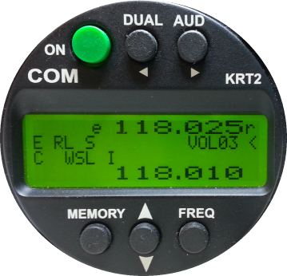

# KRT2Mngr
RemoteControl for: Dittel/TQ-Aviation radio transceiver (KRT2)

Transfer commands, like switch DUAL-Mode on/off, to an KRT2 Radio. Furthemore changes on the Radio will be reflected on the remoteControl application.
This is possible by communicating to KRT2 using it's builtin RS232 interface.

## this Project contains 2 alternative Applications/Hosts
With COMHost we provide a Windows Application which uses a SerialPort to communicate with the connected KRT2.
With [BTHost](BTHost/README.md) we provide a Windows Application which uses a Bluetooth Name/Address to connect an KRT2 which have an Bluetooth to Serial adapter.

## roadmap (functional aspect, less important is at top)
probably the BT Version is the more interesting thing cause most devices does not have COM interfaces anymore.
The SerialPort Version is the head of development activity and the most stable Version because it is simpler.
- [ ] provide WindowsApplication's with x86/x64 Bitness
- [ ] provide as Android App
- [ ] upload settings to KRT2 preiviously downloaded and saved to restore configuration after a hard reset
- [ ] download settings from KRT2 and persist them is a classic file
- [ ] download Station List and persist them is a classic *.csv file
- [ ] upload Station List from *.csv file to KRT2 (maintain Station List's offline)

## roadmap (architectureal aspect, less important is at top)
- [ ] 3 layered architecture to splitt KRT2 Protocol specific things (ack/nak/checksum/ping ...) from Payload
- [ ] 2 layered architecture to reuse the JavaScript/HTML GUI with all different Windows Applications and the Android App

## History
- [X] csv parser, demo Data
- [X] persistence module, open file. uploadToKRT2(), GUI with img/map
